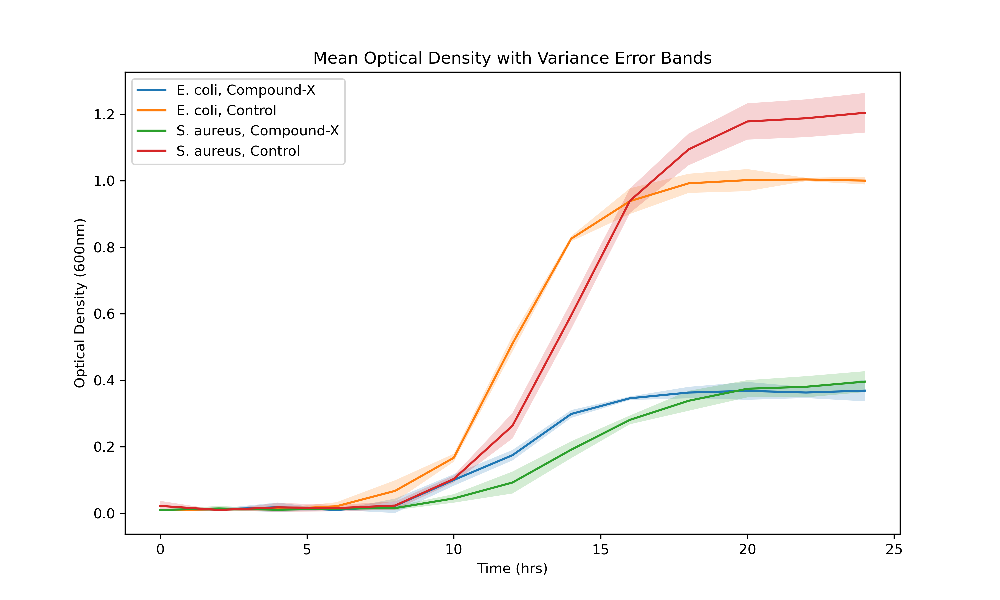

# Applied Microbe Solutions: Bacterial Growth Analysis

## Overview

This repository contains all scripts, data, and instructions necessary to replicate the analysis of bacterial growth under different treatments. The project focuses on comparing the growth dynamics of *E. coli* and *S. aureus* strains, using optical density measurements over time, and visualizing the results with professional plots including error bands. Statistical testing (t-tests) is also performed to compare treatment effects.

---

## Repository Structure

```
Applied_microbe_solutions/
│
├── Data/
│   └── bacterial_growth_data.csv         # Raw experimental data
│   └── clean_dataframe.csv               # Cleaned data after preprocessing
│
├── Output/
│   └── Replicate_growth_lineplot.png     # Growth curves by replicate
│   └── Lineplot_compoundX.png            # Mean growth curves with error bands
│
├── Scripts/
│   └── analysis.py                       # Main analysis script
│
├── README.md                             # This file
```

---

## Requirements

- Python 3.8+
- [pandas](https://pandas.pydata.org/)
- [numpy](https://numpy.org/)
- [matplotlib](https://matplotlib.org/)
- [seaborn](https://seaborn.pydata.org/)
- [scipy](https://scipy.org/) (for statistical tests)

Install dependencies with:

```bash
pip install pandas numpy matplotlib seaborn scipy
```

---

## Data Description

- **bacterial_growth_data.csv**: Contains columns:
  - `Strain`: Bacterial strain (*E. coli* or *S. aureus*)
  - `Treatment`: Experimental treatment group
  - `Replicate`: Replicate number
  - `Time_hrs`: Time in hours
  - `Optical_Density_600nm`: Optical density measurement at 600nm

---

## How to Run the Analysis

1. **Clone the repository:**

    ```bash
    git clone <repository-url>
    cd Applied_microbe_solutions
    ```

2. **Ensure the data is in the `Data/` folder.**

3. **Run the analysis script:**

    ```bash
    python Scripts/analysis.py
    ```

    This will:
    - Load and inspect the data
    - Clean and interpolate missing values
    - Save the cleaned data to `Data/clean_dataframe.csv`
    - Generate and save plots to the `Output/` folder
    - Perform t-tests to compare treatments

---

## Analysis Workflow

1. **Data Loading & Inspection**
    - Loads raw CSV data.
    - Checks for missing values and data types.

2. **Data Cleaning**
    - Sorts data for consistent processing.
    - Interpolates missing optical density values within each group (`Strain`, `Treatment`, `Replicate`).
    - Drops any remaining missing values.
    - Converts categorical columns for efficiency.

3. **Exploratory Data Analysis (EDA)**
    - Plots growth curves for each replicate and strain.
    - Calculates group means and variances for optical density.

4. **Visualization**
    - Plots mean growth curves for each strain and treatment.
    - Adds error bands (mean ± standard deviation) using `plt.fill_between` for professional visualization.

5. **Statistical Testing**
    - Performs independent t-tests (using `scipy.stats.ttest_ind`) to compare the effects of treatments (e.g., Control vs. CompoundX) within each strain.
    - Example code:

      ```python
      import scipy.stats as sp
      t_stat, p_value = sp.ttest_ind(
          df_cleaned_E[df_cleaned_E["Treatment"] == "Control"]["Optical_Density_600nm"],
          df_cleaned_E[df_cleaned_E["Treatment"] == "CompoundX"]["Optical_Density_600nm"]
      )
      print(f"T-statistic: {t_stat}, P-value: {p_value}")
      ```

---

## Example Plots

- **Growth Curves by Replicate:**  
  

- **Mean Growth Curves with Error Bands:**  
  

---

## Interpretation

- *E. coli* strains exhibit faster initial growth.
- Over time, *S. aureus* surpasses the maximum growth level reached by *E. coli*.
- Statistical tests (t-tests) help determine if treatment effects are significant.

---

## Customization

- To analyze additional strains or treatments, add them to the CSV and rerun the script.
- Modify plotting parameters in `Scripts/analysis.py` for different visual styles.
- Adjust statistical tests as needed for your experimental design.

---

## Troubleshooting

- **No plots generated?**  
  Ensure all dependencies are installed and the data file is present in the correct folder.

- **Error bars not showing?**  
  Make sure you are plotting with the correct DataFrame and using `plt.fill_between` for error bands.

- **Statistical test errors?**  
  Check that your data subsets are not empty and contain numeric values.

---

## License

This project is licensed under the MIT License.

---

## Contact

For questions or collaboration, please open an issue or contact the repository owner.
